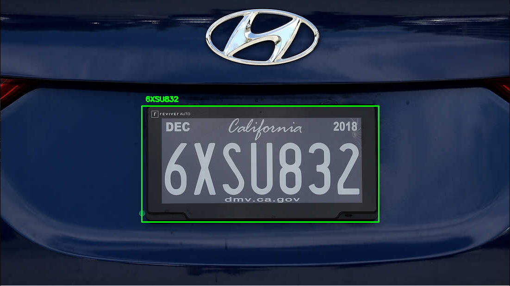

# License-Plate-Recognition



A personal project for detect and read car license plates from images or videos, the information read from the license is saved com a CSV file.
The code was made using easyocr, pytorch and opencv.
The network used for object detection was Yolov8n.
> This Project was inspired on this video https://www.youtube.com/watch?v=73REqZM1Fy0&t=964s

## 🔨 Ajustes e melhorias 
The project is simple and has a lot of room for improvement, I think the next updates will be focused on this tasks:
- [ ] Improve/change the training dataset
- [ ] Retrain the network for more epochs
- [ ] Improve the ocr (most of the inference has one or more incorrect reading)

Feel free to open issues for feedbacks, ideas and corrections.

## 🚀 Installation
The code and tests were made on Linux, but probably will work just fine on other os.
1. Clone the repository

2. create a conda environment 
```
conda create -n plate_recognition
```
3. Install requirements
```
pip install -r requirements.txt
```
### Inference
For inference you just need to run the main script
```
python main.py
```
### Train
If you would like to train the model in a small license plate dataset from Roboflow, run the following
```
python main.py
```
The training was made for 30 epochs only, the model has a lot of room for improvement and it is possible that the dataset is not general enough.
